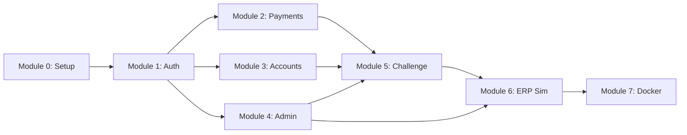

# Vault Treasury — Implementation Plan

> Module-by-module parallel development approach.

---

## Development Philosophy

Each module builds **frontend + backend together** before moving to the next. This ensures:
- Working features at every checkpoint
- Faster feedback loops
- No integration surprises at the end

---

## Tech Stack

| Layer | Technology | Reference |
|-------|------------|-----------|
| Frontend | Next.js 14+ (App Router) | [system_architecture.md](file:///home/raizel/Work/vault-treasury/system_architecture.md) |
| UI | Shadcn UI + Radix + Tailwind | [design_system.md](file:///home/raizel/Work/vault-treasury/design_system.md) |
| Animations | Framer Motion | [design_system.md](file:///home/raizel/Work/vault-treasury/design_system.md) |
| Backend | NestJS (TypeScript) | [system_architecture.md](file:///home/raizel/Work/vault-treasury/system_architecture.md) |
| Database | Supabase (PostgreSQL) | [db_schema.md](file:///home/raizel/Work/vault-treasury/db_schema.md) |
| Worker | BullMQ + @nestjs/schedule | [system_architecture.md](file:///home/raizel/Work/vault-treasury/system_architecture.md) |
| Containers | Docker + Docker Compose | [system_architecture.md](file:///home/raizel/Work/vault-treasury/system_architecture.md) |

---

## Module Overview

| Module | Frontend | Backend | Sentinel |
|--------|----------|---------|----------|
| **0. Project Setup** | Next.js + Shadcn | NestJS scaffold | — |
| **1. Auth** | Login, Signup pages | JWT Guard, Supabase | Telemetry starts |
| **2. Payment Queue** | List, Detail, Actions | CRUD endpoints | Approve/Reject gated |
| **3. Accounts** | List, Detail, Limits | CRUD endpoints | Limit change gated |
| **4. Admin Panel** | Signups, Users pages | Admin endpoints | User management gated |
| **5. Challenge Modal** | Modal component | 428 response handling | Behavioral 2FA |
| **6. ERP Simulator** | Admin controls | BullMQ worker | Toggle gated |
| **7. Docker & Deploy** | Dockerfile | Dockerfile + Compose | — |

---

## Module 0: Project Setup

### Goal
Initialize both projects and run database migrations.

### Frontend Tasks
- [ ] Create Next.js 14 app with App Router
- [ ] Install Shadcn UI, configure Tailwind
- [ ] Set up design system (CSS variables from [design_system.md](file:///home/raizel/Work/vault-treasury/design_system.md))
- [ ] Create layout with sidebar navigation
- [ ] Configure Supabase client

### Backend Tasks
- [ ] Create NestJS project with TypeScript
- [ ] Set up module structure (auth, payments, accounts, admin)
- [ ] Configure Supabase client
- [ ] Create Sentinel HTTP service module
- [ ] Set up validation (class-validator)

### Database Tasks
- [ ] Run database migrations in Supabase ([db_schema.md](file:///home/raizel/Work/vault-treasury/db_schema.md))
- [ ] Seed data (accounts, limits, ERP config)

### Verification
```bash
# Frontend
cd frontend && npm run dev
# http://localhost:3000 → Shows layout

# Backend
cd backend && npm run start:dev
# http://localhost:8001/api/health → 200 OK
```

---

## Module 1: Authentication

### Goal
Login/logout with Supabase JWT. Behavioral telemetry starts on auth pages.

### Frontend Tasks
- [ ] `/login` page with email/password form
- [ ] `/signup` page (access request form)
- [ ] Auth middleware (redirect if not logged in)
- [ ] JWT storage in httpOnly cookie
- [ ] Telemetry provider (keyboard + mouse collection)
- [ ] Start streaming to Sentinel `/stream/keyboard` and `/stream/mouse`

### Backend Tasks
- [ ] `auth.module.ts` — JWT strategy with Supabase secret
- [ ] `auth.guard.ts` — Protect routes
- [ ] Extract `user_id`, `role` from JWT claims
- [ ] Role-based guards (`TreasuryGuard`, `AdminGuard`)

### Database
- Tables used: `users`, `treasury_profiles`, `signup_requests`
- RLS: Signup requests insertable by anyone

### Verification
```bash
# Login with treasury admin
POST /auth/login → JWT returned
# Protected route without token
GET /api/payments → 401 Unauthorized
# Protected route with token
GET /api/payments → 200 OK
```

---

## Module 2: Payment Queue

### Goal
Main work screen — list payments, view details, approve/reject with Sentinel gating.

### Frontend Tasks
- [ ] `/payments` page with payment list table
- [ ] Filters (status, priority, date range)
- [ ] Payment card layout (from [feature_map.md](file:///home/raizel/Work/vault-treasury/feature_map.md))
- [ ] `/payments/[id]` detail page with action history
- [ ] Approve/Reject buttons (call Smart Fetch wrapper)

### Backend Tasks
- [ ] `payments.module.ts`
- [ ] `GET /api/payments` — List with filters, pagination
- [ ] `GET /api/payments/:id` — Detail with actions history
- [ ] `POST /api/payments/:id/approve` — Sentinel-gated
- [ ] `POST /api/payments/:id/reject` — Sentinel-gated
- [ ] `SentinelGuard` middleware for protected endpoints

### Database
- Tables used: `payments`, `payment_actions`, `accounts`
- On approve/reject: Insert into `payment_actions` with Sentinel score

### Sentinel Integration
| Endpoint | Guard |
|----------|-------|
| `POST /api/payments/:id/approve` | ✅ SentinelGuard |
| `POST /api/payments/:id/reject` | ✅ SentinelGuard |

### Verification
```bash
# Assuming ALLOW decision
POST /api/payments/:id/approve → 200 OK
# Payment status updated, action logged
```

---

## Module 3: Account Management

### Goal
View accounts, balances, and modify transaction limits.

### Frontend Tasks
- [ ] `/accounts` page with account list
- [ ] `/accounts/[id]` detail with:
  - Balance display
  - Recent transactions (from `payment_actions`)
  - Current limits
  - Limit modification form

### Backend Tasks
- [ ] `accounts.module.ts`
- [ ] `GET /api/accounts` — List all accounts
- [ ] `GET /api/accounts/:id` — Detail with limit history
- [ ] `PATCH /api/accounts/:id/limits` — Sentinel-gated

### Database
- Tables used: `accounts`, `account_limits`, `payments`

### Sentinel Integration
| Endpoint | Guard |
|----------|-------|
| `PATCH /api/accounts/:id/limits` | ✅ SentinelGuard |

### Verification
```bash
# Modify daily limit
PATCH /api/accounts/:id/limits { daily: 300000 } → 200 OK
# Limit updated, history recorded
```

---

## Module 4: Admin Panel

### Goal
Manage signup requests and users. Sentinel-gated actions.

### Frontend Tasks
- [ ] `/admin/signups` — List pending requests
- [ ] Approve/Reject buttons for each request
- [ ] `/admin/users` — List active users
- [ ] Deactivate user button

### Backend Tasks
- [ ] `admin.module.ts`
- [ ] `GET /api/admin/signups` — List pending
- [ ] `POST /api/admin/signups/:id/approve` — Sentinel-gated
- [ ] `POST /api/admin/signups/:id/reject` — Sentinel-gated
- [ ] `GET /api/admin/users` — List treasury users
- [ ] `POST /api/admin/users/:id/deactivate` — Sentinel-gated

### User Approval Flow
1. Admin approves signup request
2. Backend creates entry in `users` table (via Supabase admin API)
3. Backend creates `treasury_profiles` entry
4. User receives email with login credentials

### Database
- Tables used: `signup_requests`, `users`, `treasury_profiles`

### Sentinel Integration
| Endpoint | Guard |
|----------|-------|
| `POST /api/admin/signups/:id/approve` | ✅ SentinelGuard |
| `POST /api/admin/signups/:id/reject` | ✅ SentinelGuard |
| `POST /api/admin/users/:id/deactivate` | ✅ SentinelGuard |

---

## Module 5: Challenge Modal (Behavioral 2FA)

### Goal
Handle 428 responses with typing challenge. Smart Fetch wrapper with auto-retry.

### Frontend Tasks
- [ ] `ChallengeModal.tsx` component
  - Display challenge text (paragraph to type)
  - Input field with progress indicator
  - Keyboard events stream to Sentinel during typing
- [ ] `SmartFetch` wrapper class
  - Intercept 428 responses
  - Show modal, wait for completion
  - Auto-replay original request
- [ ] Handle 401 + `X-Session-Terminated` → redirect to `/terminated`
- [ ] `/terminated` page with explanation

### Backend Tasks
- [ ] `SentinelGuard` returns 428 with `challenge_text` on CHALLENGE
- [ ] Returns 401 + header on BLOCK
- [ ] Calls `supabase.auth.admin.signOut()` on BLOCK

### Challenge Flow (from [feature_map.md](file:///home/raizel/Work/vault-treasury/feature_map.md))
1. User action triggers 428
2. Modal appears with random paragraph
3. User types paragraph → events stream to Sentinel
4. User clicks Verify → keyboard + mouse captured
5. Smart Fetch replays original request
6. Request succeeds (Sentinel now trusts user)

### Verification
```bash
# Force CHALLENGE decision in test
POST /api/payments/:id/approve → 428 { challenge_text: "..." }
# After typing challenge
POST /api/payments/:id/approve → 200 OK
```

---

## Module 6: ERP Simulator

### Goal
Admin-controlled background job that generates realistic payments.

### Frontend Tasks
- [ ] ERP Simulator card on `/admin/users` page
  - Status indicator (Active/Inactive)
  - Start/Stop toggle (Sentinel-gated)
  - Rate configuration (payments per minute)
  - Amount range inputs
  - Last generated payment info

### Backend Tasks
- [ ] `erp-simulator.module.ts`
- [ ] `GET /api/erp-simulator/status` — Current config
- [ ] `POST /api/erp-simulator/start` — Sentinel-gated
- [ ] `POST /api/erp-simulator/stop` — Sentinel-gated
- [ ] `PATCH /api/erp-simulator/config` — Update settings
- [ ] BullMQ cron job for payment generation
- [ ] Payment generation logic:
  - Random amount within range
  - Random source (internal) → destination (external) account
  - Random priority
  - Insert into `payments` table

### Database
- Tables used: `erp_simulator_config`, `payments`, `accounts`

### Sentinel Integration
| Endpoint | Guard |
|----------|-------|
| `POST /api/erp-simulator/start` | ✅ SentinelGuard |
| `POST /api/erp-simulator/stop` | ✅ SentinelGuard |

### Verification
```bash
# Start simulator
POST /api/erp-simulator/start → 200 OK
# Wait 30 seconds
GET /api/payments?status=pending → New payments appear
```

---

## Module 7: Docker & Deployment

### Goal
Containerize the application for production deployment.

### Tasks
- [ ] Create `frontend/Dockerfile` (multi-stage build)
- [ ] Create `backend/Dockerfile` (multi-stage build)
- [ ] Create root `docker-compose.yml`
  - frontend service (port 3000)
  - backend service (port 8001)
  - redis service (port 6379)
- [ ] Create `docker-compose.dev.yml` override (hot-reloading)
- [ ] Create `.dockerignore` files
- [ ] Test full stack with Docker Compose
- [ ] Deploy to Railway / Fly.io

### Verification
```bash
docker-compose up --build
# Frontend: http://localhost:3000
# Backend: http://localhost:8001/api/health → 200 OK
# Full flow works end-to-end
```

---

## Module Dependencies



---

## Verification Checklist

### Per Module
- [ ] Frontend renders without errors
- [ ] Backend endpoints return expected data
- [ ] Database operations work (insert, update, select)
- [ ] Sentinel guard triggers correctly for protected routes

### End-to-End
- [ ] Login → Payment Queue → Approve Payment → Success
- [ ] Login → Payment Queue → Approve → Challenge → Type → Success
- [ ] Login → Admin → Start ERP Simulator → Payments appear
- [ ] Suspicious behavior → BLOCK → Session terminated

---

## Reference Documents

| Document | Purpose |
|----------|---------|
| [feature_map.md](file:///home/raizel/Work/vault-treasury/feature_map.md) | Screen layouts, user flows, Sentinel integration points |
| [db_schema.md](file:///home/raizel/Work/vault-treasury/db_schema.md) | SQL migrations, RLS policies, seed data |
| [design_system.md](file:///home/raizel/Work/vault-treasury/design_system.md) | Colors, typography, components, animations |
| [system_architecture.md](file:///home/raizel/Work/vault-treasury/system_architecture.md) | Tech stack, directory structure, API routes, Docker |
