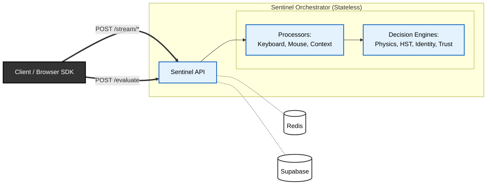

# Sentinel System Architecture

Sentinel follows a **stateless processing / stateful storage** pattern designed to scale horizontally while maintaining strict consistency for user trust scores.

## High-Level Layout

## Core Components

### 1. Client (Integration Layer)
The client application (e.g., a web dashboard or login page) collects raw events—keystrokes and mouse movements—and buffers them. It sends these batches to the Sentinel API asynchronously to minimize impact on the user experience.

### 2. Orchestrator (The "Brain")
The Orchestrator is the central controller. It:
*   Receives incoming event batches.
*   Hydrates the user's state from Redis.
*   Routes data to the appropriate ML models.
*   Updates the trust score based on model outputs.
*   Decides on an action (ALLOW, CHALLENGE, BLOCK).

### 3. Models (Intelligence)
Statistical and ML models that analyze behavior.
*   **Physics Models** (`PhysicsMouseModel`): Deterministic detection of impossible human movements using tiered biomechanical thresholds. Zero ML, zero learning.
*   **Anomaly Models** (`KeyboardAnomalyModel`): River Half-Space Trees for online anomaly detection on keystroke dynamics. Used for both generic "human" detection (HST) and per-user identity verification.
*   **Navigator Policy Engine** (`NavigatorPolicyEngine`): Stateless rule engine for context-based risk (impossible travel, device mismatch, policy violations).

### 4. Persistence Layer (Memory)
*   **Redis (Hot Storage)**: Stores the *current* session state, trust score, and temporal windows. We use Redis for its low latency and atomic operations, which are critical when multiple event streams arrive simultaneously.
*   **Supabase (Cold Storage)**: Persists long-term user profiles and audit logs for post-incident analysis.

## Scaling Strategy

Sentinel is designed to be **stateless at the compute layer**. Any Sentinel API node can handle a request for any user, as long as it can reach the shared Redis cluster. This allows you to scale the API tier horizontally by simply adding more workers.

No single request contains enough information to authenticate a user; trust emerges only through state accumulation.

*Note: A Redis outage degrades Sentinel to a fail-safe CHALLENGE mode rather than hard ALLOW.*
