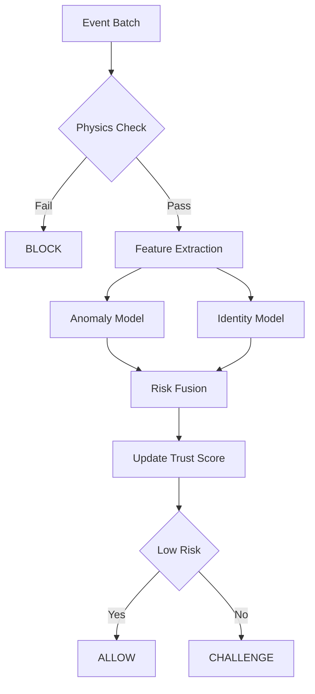
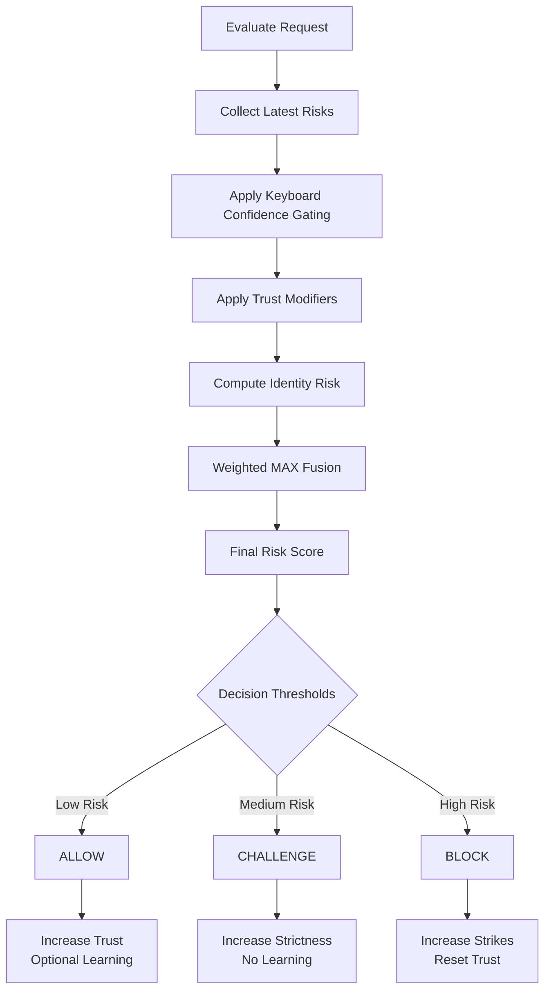
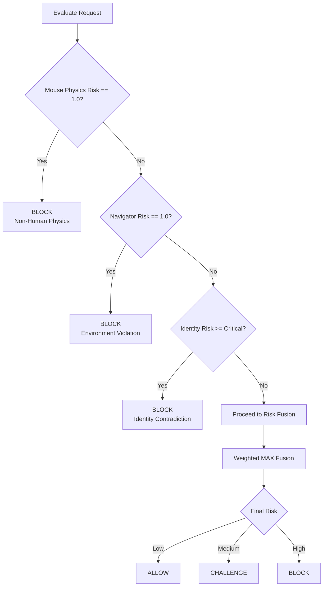

# The Sentinel Decision Engine 

The heart of Sentinel is the Decision Engine, which converts raw signals into a unified trust score.

## Risk Philosophy: Time-Variant Trust

Sentinel does not believe trust is static. Just because you logged in successfully 10 minutes ago does not mean you are still the same person. Trust decays over time unless reinforced by positive behavior.

## Trust Phases

> **Note**: Trust Score ranges from 0.0 (no trust) to 1.0 (fully trusted). Lower scores indicate higher risk.

### 1. Cold Start
*   **State**: `UNKNOWN`
*   **Duration**: Until 15 keyboard feature windows are collected (`KEYBOARD_COUNT_MATURITY`) and at least 20 seconds have elapsed (`KEYBOARD_TIME_MATURITY`). Keyboard confidence is computed as `√(time_confidence × count_confidence)`.
*   **Logic**: High scrutiny. Physics violations trigger immediate block. Identity models are disabled until 150 samples are collected.

### 2. Trust Formation
*   **State**: `VERIFYING`
*   **Duration**: Until trust score ≥ 0.75 (`TRUSTED_THRESHOLD`).
*   **Logic**: The system aggregates positive evidence. Consistent, human-like behavior gently pushes the score up.

### 3. Mature Session
*   **State**: `TRUSTED`
*   **Duration**: Remainder of session.
*   **Logic**: The user has "proven" themselves. The system relaxes. Minor anomalies are ignored (noise), but structural anomalies (e.g., changing typing patterns entirely) cause a "Trust Crash," resetting the phase.

## Logic & Gating

### Trust Stabilizer
To prevent jittery scores (e.g., 0.8 -> 0.4 -> 0.9 in seconds), Sentinel uses a **Linear Delta Update** formula for the trust score:

```
trust_delta = 0.12 × (0.5 - final_risk)
trust_score = clamp(trust_score + trust_delta, 0.0, 1.0)
```

This pushes trust up when risk is low (< 0.5) and down when risk is high (> 0.5). If identity risk exceeds 0.9, trust is immediately reset to zero.

### Gating Rules
Not all signals are equal.
*   **Physics Gate**: If a movement is physically impossible (teleportation), risk is set to 1.0 immediately, overriding all ML models.
*   **Identity Gate**: We do not penalize a user for "not looking like themselves" until we have at least 150 feature windows for them (`IDENTITY_MODEL_SAMPLES_REQUIRED`).

## Weighted Fusion Formula

The final risk score uses a **Weighted MAX Fusion** approach to prioritize the strongest threat signal. Each component is multiplied by its weight, and the maximum is taken:

```
final_risk = max(
    keyboard_risk × 0.70,
    mouse_risk × 0.90,
    navigator_risk × 1.00,
    identity_risk × confidence × 0.65
)
```

| Component | Weight (NORMAL) | Weight (CHALLENGE) |
|-----------|-----------------|-------------------|
| Keyboard  | 0.70            | 0.85              |
| Mouse     | 0.90            | 1.00              |
| Navigator | 1.00            | 1.00              |
| Identity  | 0.65            | 0.85              |

*Note: Physics violations (mouse teleportation) result in immediate BLOCK regardless of other scores. Identity weight is further scaled by `√confidence`.*

## Logical Decision Flowchart



## Risk fusion & Decision Lifecycle



## Override & Priority Rules



**Thresholds by Mode:**
| Mode      | ALLOW         | CHALLENGE        | BLOCK        |
|-----------|---------------|------------------|--------------|
| NORMAL    | risk < 0.50   | 0.50 ≤ risk < 0.85 | risk ≥ 0.85 |
| CHALLENGE | risk < 0.40   | 0.40 ≤ risk < 0.75 | risk ≥ 0.75 |
| TRUSTED   | risk < 0.60   | 0.60 ≤ risk < 0.92 | risk ≥ 0.92 |
