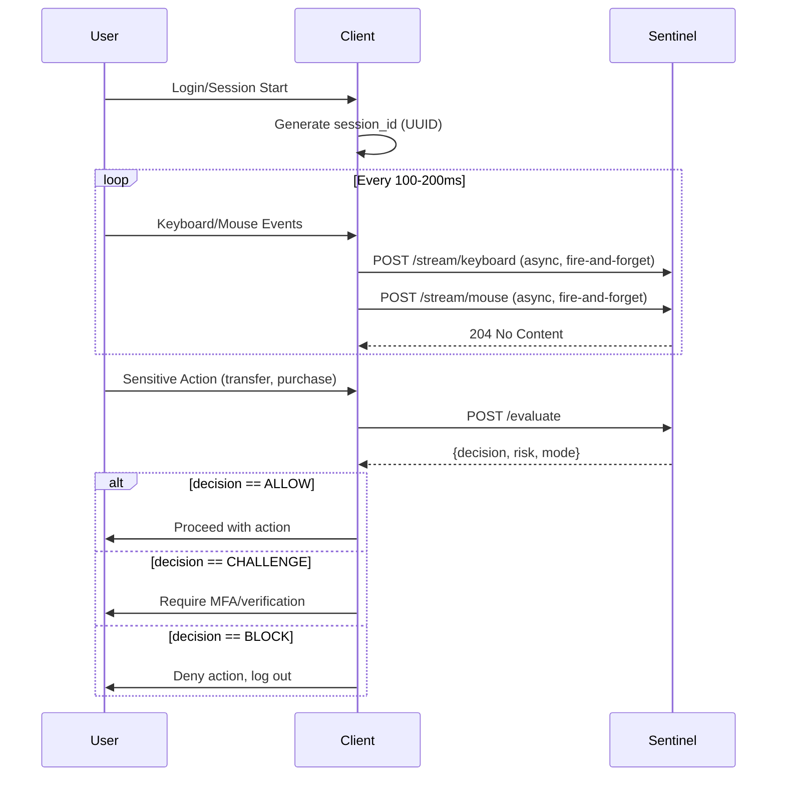

# Sentinel Client Middleware Integration Guide

> **Purpose**: This guide provides client developers with everything needed to integrate their application with the Sentinel behavioral biometrics API for continuous authentication.

## Table of Contents
1. [Architecture Overview](#1-architecture-overview)
2. [Integration Flow](#2-integration-flow)
3. [Biometric Event Collection](#3-biometric-event-collection)
4. [API Endpoints](#4-api-endpoints)
5. [Data Schemas](#5-data-schemas)
6. [Implementation Guide](#6-implementation-guide)
7. [Error Handling](#7-error-handling)
8. [Security Considerations](#8-security-considerations)
9. [Example Implementations](#9-example-implementations)
10. [Testing Your Integration](#10-testing-your-integration)

---

## 1. Architecture Overview

Sentinel operates as a **stateless API** that maintains user session state in Redis. The client middleware is responsible for:

1. **Collecting** keyboard and mouse events from the user
2. **Batching** events (every 100-200ms recommended)
3. **Streaming** batches to Sentinel asynchronously
4. **Requesting** evaluation at decision points (login, checkout, sensitive actions)
5. **Enforcing** the returned decision (ALLOW, CHALLENGE, BLOCK)

```
┌─────────────────────────────────────────────────────────────────────────────┐
│                             CLIENT APPLICATION                               │
├─────────────────────────────────────────────────────────────────────────────┤
│                                                                              │
│  ┌──────────────────┐    ┌──────────────────┐    ┌─────────────────────┐   │
│  │  Event Listener  │───▶│  Event Buffer    │───▶│  Sentinel Middleware│   │
│  │  (keyboard/mouse)│    │  (100-200ms)     │    │  (HTTP Client)      │   │
│  └──────────────────┘    └──────────────────┘    └──────────┬──────────┘   │
│                                                              │              │
└──────────────────────────────────────────────────────────────┼──────────────┘
                                                               │
                                              POST /stream/*   │   POST /evaluate
                                                               ▼
                                        ┌──────────────────────────────────────┐
                                        │           SENTINEL API               │
                                        │         (Port 8000)                  │
                                        └──────────────────────────────────────┘
```

---

## 2. Integration Flow

### Session Lifecycle



### Key Principles

| Principle | Description |
|-----------|-------------|
| **Async Streaming** | Stream endpoints return 204 immediately, never block |
| **Sync Evaluation** | Evaluate endpoint returns decision synchronously |
| **Session Isolation** | Each session_id is independent; user_id links identity |
| **Anti-Replay** | batch_id must be strictly sequential per session |
| **Rate Limiting** | 20 batches/sec for streaming, 10 evals/sec |

---

## 3. Biometric Event Collection

### Keyboard Events

Capture both keydown and keyup events with high-resolution timestamps.

```javascript
// Browser JavaScript Example
const eventBuffer = [];
let batchId = 1;

document.addEventListener('keydown', (e) => {
    eventBuffer.push({
        key: e.key,
        event_type: 'DOWN',
        timestamp: performance.now() + performance.timeOrigin  // ms since epoch
    });
});

document.addEventListener('keyup', (e) => {
    eventBuffer.push({
        key: e.key,
        event_type: 'UP',
        timestamp: performance.now() + performance.timeOrigin
    });
});
```

### Mouse Events

Capture move and click events. Sample moves at reasonable intervals (every 10-20ms).

```javascript
let lastMoveTime = 0;
const MOVE_SAMPLE_RATE = 16; // ~60fps

document.addEventListener('mousemove', (e) => {
    const now = performance.now() + performance.timeOrigin;
    if (now - lastMoveTime >= MOVE_SAMPLE_RATE) {
        eventBuffer.push({
            x: e.clientX,
            y: e.clientY,
            event_type: 'MOVE',
            timestamp: now
        });
        lastMoveTime = now;
    }
});

document.addEventListener('click', (e) => {
    eventBuffer.push({
        x: e.clientX,
        y: e.clientY,
        event_type: 'CLICK',
        timestamp: performance.now() + performance.timeOrigin
    });
});
```

### Timestamp Requirements

> **CRITICAL**: All timestamps must be in **milliseconds since Unix epoch**.

| Source | Format | Example |
|--------|--------|---------|
| JavaScript | `performance.now() + performance.timeOrigin` | `1707244800123.456` |
| Python | `time.time() * 1000` | `1707244800123.456` |
| Kotlin | `System.currentTimeMillis().toDouble()` | `1707244800123.0` |

---

## 4. API Endpoints

### Base URL
```
http://<sentinel-host>:8000
```

### 4.1 Health Check

```http
GET /health
```

**Response** (200 OK):
```json
{
  "status": "healthy",
  "version": "2.0.0"
}
```

---

### 4.2 Keyboard Stream

```http
POST /stream/keyboard
Content-Type: application/json
```

**Request Body**:
```json
{
  "session_id": "550e8400-e29b-41d4-a716-446655440000",
  "user_id": "user_123",
  "batch_id": 1,
  "events": [
    {"key": "h", "event_type": "DOWN", "timestamp": 1707244800100.5},
    {"key": "h", "event_type": "UP", "timestamp": 1707244800200.3},
    {"key": "e", "event_type": "DOWN", "timestamp": 1707244800250.7},
    {"key": "e", "event_type": "UP", "timestamp": 1707244800350.1}
  ]
}
```

**Response**: `204 No Content` (success, no body)

---

### 4.3 Mouse Stream

```http
POST /stream/mouse
Content-Type: application/json
```

**Request Body**:
```json
{
  "session_id": "550e8400-e29b-41d4-a716-446655440000",
  "user_id": "user_123",
  "batch_id": 1,
  "events": [
    {"x": 100, "y": 100, "event_type": "MOVE", "timestamp": 1707244800100.0},
    {"x": 115, "y": 108, "event_type": "MOVE", "timestamp": 1707244800116.0},
    {"x": 130, "y": 115, "event_type": "MOVE", "timestamp": 1707244800132.0},
    {"x": 145, "y": 122, "event_type": "CLICK", "timestamp": 1707244800200.0}
  ]
}
```

**Response**: `204 No Content` (success, no body)

---

### 4.4 Evaluate Risk

```http
POST /evaluate
Content-Type: application/json
```

**Request Body**:
```json
{
  "session_id": "550e8400-e29b-41d4-a716-446655440000",
  "request_context": {
    "ip_address": "192.168.1.100",
    "user_agent": "Mozilla/5.0 (Windows NT 10.0; Win64; x64) Chrome/120.0",
    "endpoint": "/api/transfer",
    "method": "POST",
    "user_id": "user_123"
  },
  "business_context": {
    "service": "banking_service",
    "action_type": "wire_transfer",
    "resource_target": "account_456",
    "transaction_details": {
      "amount": 5000.00,
      "currency": "USD",
      "recipient": "external_account"
    }
  },
  "role": "customer",
  "mfa_status": "verified",
  "session_start_time": 1707244800000,
  "client_fingerprint": {
    "device_id": "device_abc123",
    "ja3_hash": "e7c2a3..."
  },
  "eval_id": "eval_unique_123"
}
```

**Response** (200 OK):
```json
{
  "decision": "ALLOW",
  "risk": 0.23,
  "mode": "NORMAL"
}
```

---

## 5. Data Schemas

### 5.1 Keyboard Event

| Field | Type | Required | Description |
|-------|------|----------|-------------|
| `key` | string | ✅ | Key pressed (e.g., "a", "Enter", "Shift") |
| `event_type` | enum | ✅ | `"DOWN"` or `"UP"` |
| `timestamp` | float | ✅ | Milliseconds since Unix epoch |

### 5.2 Mouse Event

| Field | Type | Required | Description |
|-------|------|----------|-------------|
| `x` | int | ✅ | X coordinate on screen |
| `y` | int | ✅ | Y coordinate on screen |
| `event_type` | enum | ✅ | `"MOVE"` or `"CLICK"` |
| `timestamp` | float | ✅ | Milliseconds since Unix epoch |

### 5.3 Stream Payload

| Field | Type | Required | Description |
|-------|------|----------|-------------|
| `session_id` | string | ✅ | Unique session identifier (UUID) |
| `user_id` | string | ✅ | Authenticated user identifier |
| `batch_id` | int | ✅ | Sequential batch number (≥ 1) |
| `events` | array | ✅ | Array of keyboard or mouse events |

### 5.4 Evaluate Payload

| Field | Type | Required | Description |
|-------|------|----------|-------------|
| `session_id` | string | ✅ | Active session identifier |
| `request_context` | object | ✅ | Request metadata (see below) |
| `business_context` | object | ✅ | Action context (see below) |
| `role` | string | ✅ | User role (e.g., "admin", "customer") |
| `mfa_status` | string | ✅ | MFA status ("verified", "not_verified") |
| `session_start_time` | float | ✅ | Session start timestamp (ms) |
| `client_fingerprint` | object | ❌ | Optional device fingerprint |
| `eval_id` | string | ❌ | Optional ID for idempotency |

### 5.5 Request Context

| Field | Type | Required | Description |
|-------|------|----------|-------------|
| `ip_address` | string | ✅ | Client IP address |
| `user_agent` | string | ✅ | Browser user agent |
| `endpoint` | string | ✅ | API endpoint accessed |
| `method` | string | ✅ | HTTP method (GET, POST, etc.) |
| `user_id` | string | ✅ | User ID making the request |

### 5.6 Business Context

| Field | Type | Required | Description |
|-------|------|----------|-------------|
| `service` | string | ✅ | Service name (e.g., "banking") |
| `action_type` | string | ✅ | Action type (e.g., "transfer") |
| `resource_target` | string | ✅ | Target resource |
| `transaction_details` | object | ❌ | Optional transaction metadata |

### 5.7 Evaluate Response

| Field | Type | Description |
|-------|------|-------------|
| `decision` | enum | `"ALLOW"`, `"CHALLENGE"`, or `"BLOCK"` |
| `risk` | float | Risk score 0.0 (safe) to 1.0 (high risk) |
| `mode` | string | Session mode: `"NORMAL"` or `"CHALLENGE"` |

---

## 6. Implementation Guide

### 6.1 Middleware Class Structure

```javascript
class SentinelMiddleware {
    constructor(config) {
        this.baseUrl = config.sentinelUrl || 'http://localhost:8000';
        this.sessionId = this.generateSessionId();
        this.userId = config.userId;
        this.keyboardBatchId = 0;
        this.mouseBatchId = 0;
        this.keyboardBuffer = [];
        this.mouseBuffer = [];
        this.flushInterval = config.flushInterval || 150; // ms
        
        this.startCollection();
    }
    
    generateSessionId() {
        return crypto.randomUUID();
    }
    
    startCollection() {
        // Attach event listeners
        this.attachKeyboardListeners();
        this.attachMouseListeners();
        
        // Start flush timer
        setInterval(() => this.flushBuffers(), this.flushInterval);
    }
    
    async flushBuffers() {
        await Promise.all([
            this.flushKeyboard(),
            this.flushMouse()
        ]);
    }
    
    async flushKeyboard() {
        if (this.keyboardBuffer.length === 0) return;
        
        const events = [...this.keyboardBuffer];
        this.keyboardBuffer = [];
        this.keyboardBatchId++;
        
        try {
            await fetch(`${this.baseUrl}/stream/keyboard`, {
                method: 'POST',
                headers: {'Content-Type': 'application/json'},
                body: JSON.stringify({
                    session_id: this.sessionId,
                    user_id: this.userId,
                    batch_id: this.keyboardBatchId,
                    events: events
                })
            });
        } catch (error) {
            console.warn('Sentinel keyboard stream failed:', error);
            // Don't retry - fire and forget
        }
    }
    
    async evaluate(actionContext) {
        const response = await fetch(`${this.baseUrl}/evaluate`, {
            method: 'POST',
            headers: {'Content-Type': 'application/json'},
            body: JSON.stringify({
                session_id: this.sessionId,
                request_context: {
                    ip_address: actionContext.clientIp,
                    user_agent: navigator.userAgent,
                    endpoint: actionContext.endpoint,
                    method: actionContext.method,
                    user_id: this.userId
                },
                business_context: {
                    service: actionContext.service,
                    action_type: actionContext.actionType,
                    resource_target: actionContext.resourceTarget,
                    transaction_details: actionContext.transactionDetails || {}
                },
                role: actionContext.userRole,
                mfa_status: actionContext.mfaStatus,
                session_start_time: this.sessionStartTime
            })
        });
        
        return response.json();
    }
}
```

### 6.2 Decision Enforcement

```javascript
async function handleSensitiveAction(actionContext) {
    const sentinel = getSentinelMiddleware();
    const result = await sentinel.evaluate(actionContext);
    
    switch (result.decision) {
        case 'ALLOW':
            // Proceed with action
            return performAction(actionContext);
            
        case 'CHALLENGE':
            // Trigger additional verification
            const verified = await triggerMFA();
            if (verified) {
                // Re-evaluate with updated mfa_status
                actionContext.mfaStatus = 'verified';
                return handleSensitiveAction(actionContext);
            }
            return { success: false, reason: 'verification_failed' };
            
        case 'BLOCK':
            // Log security event, end session
            await logSecurityEvent('blocked_action', result);
            await endSession();
            return { success: false, reason: 'blocked' };
    }
}
```

---

## 7. Error Handling

### HTTP Status Codes

| Code | Meaning | Action |
|------|---------|--------|
| `204` | Success (stream) | Continue normally |
| `200` | Success (evaluate) | Process decision |
| `400` | Bad Request | Fix payload (schema error, replay) |
| `422` | Validation Error | Fix payload (missing/invalid fields) |
| `429` | Rate Limited | Reduce request frequency |
| `500` | Server Error | Retry with backoff |
| `503` | Service Unavailable | Sentinel down, fail-safe to CHALLENGE |

### Retry Strategy

```javascript
async function sendWithRetry(url, payload, maxRetries = 3) {
    for (let attempt = 0; attempt < maxRetries; attempt++) {
        try {
            const response = await fetch(url, {
                method: 'POST',
                headers: {'Content-Type': 'application/json'},
                body: JSON.stringify(payload)
            });
            
            if (response.status === 429) {
                // Rate limited - wait and retry
                await sleep(1000 * (attempt + 1));
                continue;
            }
            
            return response;
        } catch (error) {
            if (attempt === maxRetries - 1) throw error;
            await sleep(500 * (attempt + 1));
        }
    }
}
```

### Fail-Safe Behavior

If Sentinel is unavailable, implement fail-safe logic:

```javascript
async function evaluateWithFailsafe(actionContext) {
    try {
        return await sentinel.evaluate(actionContext);
    } catch (error) {
        console.error('Sentinel unavailable:', error);
        
        // Fail-safe: require challenge for high-risk actions
        if (isHighRiskAction(actionContext)) {
            return { decision: 'CHALLENGE', risk: 0.5, mode: 'NORMAL' };
        }
        
        // Allow low-risk actions
        return { decision: 'ALLOW', risk: 0.0, mode: 'NORMAL' };
    }
}
```

---

## 8. Security Considerations

### 8.1 Anti-Replay Protection

The `batch_id` must be **strictly sequential** for each session:

```
batch_id: 1 → 2 → 3 → 4 → ...
```

- Sending `batch_id: 3` after `batch_id: 5` returns `400 Bad Request`
- Small gaps (up to 3) are tolerated but log warnings
- Large gaps reset internal state

### 8.2 Session Isolation

- Each `session_id` maintains independent state
- Use UUID v4 for session IDs to prevent guessing
- Never reuse session IDs across users

### 8.3 Rate Limiting

| Endpoint | Limit | Scope |
|----------|-------|-------|
| `/stream/keyboard` | 20/sec | Per session |
| `/stream/mouse` | 20/sec | Per session |
| `/evaluate` | 10/sec | Per session |

### 8.4 Data Minimization

Only send required data:
- Do NOT send password characters in key events
- Filter sensitive input fields (password, SSN, card numbers)

```javascript
function isKeyAllowed(key, activeElement) {
    const sensitiveTypes = ['password', 'tel', 'number'];
    if (sensitiveTypes.includes(activeElement.type)) {
        return false; // Don't capture keys in sensitive fields
    }
    return true;
}
```

---

## 9. Example Implementations

### 9.1 JavaScript/TypeScript (Browser)

```typescript
interface SentinelConfig {
    sentinelUrl: string;
    userId: string;
    flushIntervalMs?: number;
}

class SentinelClient {
    private config: SentinelConfig;
    private sessionId: string;
    private keyboardBatch: KeyboardEvent[] = [];
    private mouseBatch: MouseEvent[] = [];
    private kbBatchId = 0;
    private mouseBatchId = 0;
    private sessionStartTime: number;
    
    constructor(config: SentinelConfig) {
        this.config = config;
        this.sessionId = crypto.randomUUID();
        this.sessionStartTime = Date.now();
        this.setupListeners();
        this.startFlushing();
    }
    
    private setupListeners() {
        document.addEventListener('keydown', (e) => this.onKey(e, 'DOWN'));
        document.addEventListener('keyup', (e) => this.onKey(e, 'UP'));
        document.addEventListener('mousemove', (e) => this.onMouse(e, 'MOVE'));
        document.addEventListener('click', (e) => this.onMouse(e, 'CLICK'));
    }
    
    async evaluate(action: ActionContext): Promise<EvaluateResponse> {
        const resp = await fetch(`${this.config.sentinelUrl}/evaluate`, {
            method: 'POST',
            headers: { 'Content-Type': 'application/json' },
            body: JSON.stringify({
                session_id: this.sessionId,
                request_context: action.requestContext,
                business_context: action.businessContext,
                role: action.role,
                mfa_status: action.mfaStatus,
                session_start_time: this.sessionStartTime
            })
        });
        return resp.json();
    }
}
```

### 9.2 Python (Backend Middleware)

```python
import time
import uuid
import httpx
from dataclasses import dataclass, field
from typing import List, Dict, Any

@dataclass
class SentinelClient:
    sentinel_url: str
    user_id: str
    session_id: str = field(default_factory=lambda: str(uuid.uuid4()))
    session_start_time: float = field(default_factory=lambda: time.time() * 1000)
    _kb_batch_id: int = 0
    _mouse_batch_id: int = 0
    
    def stream_keyboard(self, events: List[Dict[str, Any]]) -> bool:
        self._kb_batch_id += 1
        try:
            resp = httpx.post(
                f"{self.sentinel_url}/stream/keyboard",
                json={
                    "session_id": self.session_id,
                    "user_id": self.user_id,
                    "batch_id": self._kb_batch_id,
                    "events": events
                }
            )
            return resp.status_code == 204
        except httpx.RequestError:
            return False
    
    def evaluate(
        self,
        ip_address: str,
        user_agent: str,
        endpoint: str,
        method: str,
        service: str,
        action_type: str,
        resource_target: str,
        role: str = "user",
        mfa_status: str = "not_verified"
    ) -> Dict[str, Any]:
        resp = httpx.post(
            f"{self.sentinel_url}/evaluate",
            json={
                "session_id": self.session_id,
                "request_context": {
                    "ip_address": ip_address,
                    "user_agent": user_agent,
                    "endpoint": endpoint,
                    "method": method,
                    "user_id": self.user_id
                },
                "business_context": {
                    "service": service,
                    "action_type": action_type,
                    "resource_target": resource_target
                },
                "role": role,
                "mfa_status": mfa_status,
                "session_start_time": self.session_start_time
            }
        )
        return resp.json()
```

---

## 10. Testing Your Integration

### 10.1 Manual Testing

```bash
# 1. Check health
curl http://localhost:8000/health

# 2. Send keyboard stream
curl -X POST http://localhost:8000/stream/keyboard \
  -H "Content-Type: application/json" \
  -d '{
    "session_id": "test-123",
    "user_id": "user_1",
    "batch_id": 1,
    "events": [
      {"key": "h", "event_type": "DOWN", "timestamp": 1707244800100},
      {"key": "h", "event_type": "UP", "timestamp": 1707244800200}
    ]
  }'
# Expected: 204 No Content

# 3. Evaluate
curl -X POST http://localhost:8000/evaluate \
  -H "Content-Type: application/json" \
  -d '{
    "session_id": "test-123",
    "request_context": {
      "ip_address": "192.168.1.1",
      "user_agent": "Mozilla/5.0",
      "endpoint": "/api/test",
      "method": "POST",
      "user_id": "user_1"
    },
    "business_context": {
      "service": "test",
      "action_type": "test",
      "resource_target": "test"
    },
    "role": "user",
    "mfa_status": "verified",
    "session_start_time": 1707244800000
  }' | jq .
# Expected: {"decision": "CHALLENGE", "risk": 0.5, "mode": "NORMAL"}
```

### 10.2 Integration Test Checklist

| Test Case | Expected Result |
|-----------|-----------------|
| Health check | 200 with version |
| Valid keyboard stream | 204 No Content |
| Valid mouse stream | 204 No Content |
| Evaluate cold session | CHALLENGE with risk ~0.5 |
| Invalid batch_id (replay) | 400 Bad Request |
| Missing required field | 422 Unprocessable Entity |
| Rate limit exceeded | 429 Too Many Requests |
| Evaluate after warm-up | ALLOW with risk < 0.5 |

### 10.3 Load Testing

```bash
# Use hey or wrk for load testing
hey -n 1000 -c 50 -m POST \
  -H "Content-Type: application/json" \
  -d '{"session_id":"load-test","user_id":"user","batch_id":1,"events":[]}' \
  http://localhost:8000/stream/keyboard
```

---

## Appendix A: Decision Thresholds

| Mode | ALLOW | CHALLENGE | BLOCK |
|------|-------|-----------|-------|
| NORMAL | risk < 0.50 | 0.50 ≤ risk < 0.85 | risk ≥ 0.85 |
| CHALLENGE | risk < 0.40 | 0.40 ≤ risk < 0.75 | risk ≥ 0.75 |
| TRUSTED | risk < 0.60 | 0.60 ≤ risk < 0.92 | risk ≥ 0.92 |

## Appendix B: Warm-Up Requirements

For Sentinel to accurately assess risk, the session needs sufficient behavioral data:

| Metric | Minimum | Description |
|--------|---------|-------------|
| Keyboard windows | 15 | Completed typing windows |
| Keyboard duration | 20 seconds | Time since first window |
| Identity samples | 150 | For per-user identity verification |

Until these thresholds are met, confidence is reduced and CHALLENGE is more likely.

## Appendix C: Contact & Support

- **API Documentation**: `http://<sentinel-host>:8000/docs`
- **OpenAPI Spec**: `http://<sentinel-host>:8000/openapi.json`
